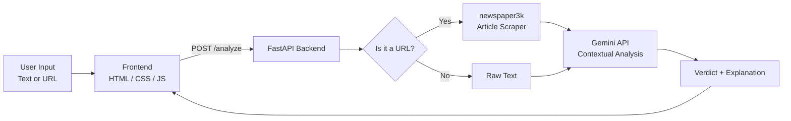

#  Fake News Detector

> An AI-powered web app that analyzes news articles and text — via direct paste or URL — to help readers spot misinformation before they share it.


---

##  The Problem

Misinformation spreads faster than fact-checkers can keep up — especially when articles are shared as raw links with no context. Most people don't have the time or expertise to verify a claim before believing or sharing it.

##  Our Solution

This project lets a user paste **article text or a link**, and get back an **AI-generated credibility analysis** in seconds. Under the hood, it:

1. Extracts clean article text from a URL (if given) using `newspaper3k`
2. Sends the content to **Google's Gemini API** for contextual, reasoning-based analysis — not just a keyword match
3. Returns a clear verdict with supporting explanation, rendered in a simple, readable UI

---

##  Features

-  **Paste-or-link input** — works with raw text or a news article URL
-  **AI-backed reasoning** — uses Gemini's language understanding instead of a static blacklist
-  **Automatic article scraping** — pulls clean article text from messy web pages via `newspaper3k`
-  **URL validation** — rejects malformed/unsafe links before processing (`validators`)
-  **Lightweight frontend** — plain HTML/CSS/JS, no framework overhead, loads instantly
-  **CORS-enabled API** — frontend and backend run independently, easy to extend or swap out

---

##  How It Works



---

##  Tech Stack

| Layer            | Technology                          |
|-------------------|--------------------------------------|
| Frontend          | HTML, CSS, JavaScript (vanilla)     |
| Backend           | FastAPI (Python)                    |
| AI / Analysis     | Google Gemini API (`google-genai`)  |
| Article Scraping  | `newspaper3k`                       |
| Input Validation  | `pydantic`, `validators`            |
| Config            | `python-dotenv`                     |

---

##  Getting Started

### 1. Clone the repo
```bash
git clone https://github.com/<your-username>/<your-repo>.git
cd <your-repo>
```

### 2. Set up a virtual environment
```bash
python -m venv venv
source venv/bin/activate        # Windows: venv\Scripts\activate
```

### 3. Install dependencies
```bash
pip install fastapi uvicorn python-dotenv requests google-genai newspaper3k pydantic validators lxml_html_clean
```

### 4. Add your Gemini API key
Create a `.env` file in the project root:
```
GEMINI_API_KEY=your_key_here
```
Get a free key at [Google AI Studio](https://aistudio.google.com/).

### 5. Run the backend
```bash
uvicorn main:app --reload --port 8000
```

### 6. Serve the frontend (in a separate terminal)
```bash
python -m http.server 5500
```

### 7. Open the app
Visit **http://localhost:5500/index.html** in your browser. Paste an article or link, hit analyze, and see the result.

> **Note:** the backend must stay running in its own terminal for the frontend to get responses.

---

## 📸 Screenshots

<!-- Add 2-3 screenshots or a short GIF of the app in use here -->
`[screenshot of homepage]`


`[screenshot of an analysis result]`


---

##  Future Scope

- Confidence scoring alongside the AI's qualitative verdict
- Support for multiple languages
- Browser extension for one-click analysis while browsing
- Caching previously analyzed URLs to reduce redundant API calls
- User feedback loop to flag incorrect verdicts for review

---

##  InventoX Team members:

| Name | USN | Role |
|------|-----|------|
| Nikhil A | 1AY25IS144 | Team lead, AI setup and workflow of application |
| Gagan HM | 1AY25IS069 | Backend setup |
| Deekshith Reddy D | 1AY25IS059 | PPT & Making record of github workflow |
| Shimsha B G | 1AY25IS218 | Frontend UI |
| Akshitha M N | 1AY25IS018 | Frontend logic |
| Sushmitha | 1AY25IS247 | Research & Testing |

---

**Course:** VTU — Information Science and Engineering, Semester 2

**Institution:** Acharya Institute of Technology, Bengaluru

**Project Type:** Interdisciplinary Project (IDP)

---

##  Acknowledgments

- [Google Gemini API](https://ai.google.dev/) for the analysis engine
- [newspaper3k](https://github.com/codelucas/newspaper) for article extraction
- [FastAPI](https://fastapi.tiangolo.com/) for the backend framework
